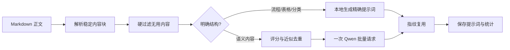

# 公众号拆文与提示词 Token 优化设计

## 目标

把现有“逐段调用模型生成配图提示词”改为本地预分析、确定性图解零调用、语义候选一次批量调用。减少无用配图和 Token 消耗，同时保留流程、表格、分类等知识结构的准确性。

## 核心规则

1. 仅修改微信公众号写作流程，不影响小红书生图模块。
2. 先把 Markdown 解析成稳定内容块，再过滤排版噪声、答案展开控件、代码围栏、尺寸说明、提示词说明、水印说明等无视觉价值内容。
3. 明确流程、表格和分类映射由本地规则生成提示词，不调用文本模型，节点、标签、分类名及顺序必须逐字保留。
4. 其余高价值语义候选合并为一次 Qwen 请求，默认优先 `qwen3.7-max`；只有额度或模型不可用错误才通过现有模型选择器降级。
5. 单次生成最多 8 张，其中语义候选最多 6 张；模型输入最多 24 个候选、每块 500 字、总计 12000 字。
6. 无候选时返回成功空结果；`none` 模式不得调用文本模型，也不得产生 Token 或费用。
7. 用内容指纹和生成指纹复用未变化或近似重复的提示词与图片。文章位置变化不应导致重新生成。
8. 过时占位符从文章中移除，但历史图片资产继续保存在公众号素材库。

## 分析流程



## 内容识别

- `ContentBlock` 保存原始顺序、标题路径、原文、清洗文本和 SHA-256 指纹。
- 硬过滤必须先于箭头和表格识别，避免 `<details> -> <summary>` 被误判成流程。
- 结构识别只接受完整流程节点、有效 Markdown 表格、明确的类别到成员映射。
- 语义候选按信息密度、结构性、与标题相关性评分；字符 bigram Jaccard 相似度达到 `0.82` 时只保留得分更高者。

## 模型调用

- system 消息只包含固定行为和 JSON 输出契约。
- user 消息只包含一次文章标题、形象摘要、剩余槽位和去重后的候选列表，不重复粘贴候选。
- 正常路径最多一次请求；只有明确额度或模型不可用错误允许第二次降级请求。
- 非额度错误或 JSON 解析失败时保留确定性结果，不为装饰性配图继续重试。

## 持久化与费用

- `WechatMpArticleSection` 增加 `source_fingerprint`、`analysis_version`。
- `WechatMpImagePrompt` 增加 `generation_fingerprint`。
- 批量语义调用只写一条 `UsageRecord(step="generate_image_prompts_batch")`。
- 展示费用以 `Decimal` 分摊给语义提示词，舍入差额归最后一条，合计必须等于 usage 记录。
- 确定性提示词、复用提示词和 `none` 模式费用均为零。

## API 与前端

`POST /articles/{id}/prompts` 返回：

```json
{
  "items": [],
  "analysis": {
    "source_blocks": 0,
    "filtered_blocks": 0,
    "deterministic_prompts": 0,
    "semantic_candidates": 0,
    "reused_prompts": 0,
    "model_calls": 0,
    "input_tokens": 0,
    "output_tokens": 0
  }
}
```

写作页显示分析摘要；无候选时明确提示没有值得配图的正文内容；`none` 显示已跳过正文提示词与生图费用。

## 验收

- `<details>/<summary>`、点击查看答案、代码块和尺寸文字不产生候选。
- `需求获取 -> 需求分析 -> 需求确认` 本地生成且模型调用为 0。
- 多个语义段落正常路径只调用模型 1 次。
- 相同正文再次生成复用原 ID，不增加费用或修订号。
- 无候选与 `none` 均返回 201 空结果且零调用。
- 前端构建、后端全量测试、迁移升级和 Atlas 健康检查通过。
